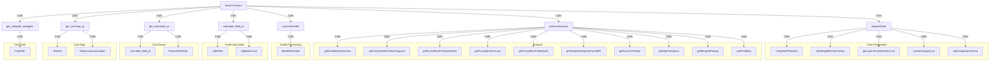

```mermaid
graph TB
    A[Main Function] -->|Calls| B[prepareData]
    A -->|Calls| C[performAnalysis]
    A -->|Calls| D[processDzialki]
    A -->|Calls| E[calculate_field_pt]
    A -->|Calls| F[get_costraster_pt]
    A -->|Calls| G[get_costmap_pt]
    A -->|Calls| H[get_costpath_energetic]

    B -->|Calls| I[mergeNMTRasters]
    B -->|Calls| J[clipMergedRasterToArea]
    B -->|Calls| K[getLayersFromDirectoryList]
    B -->|Calls| L[createCategoryList]
    B -->|Calls| M[clipCategoriesToArea]

    C -->|Calls| N[getEuclideanDistances]
    C -->|Calls| O[getFuzzyMemForSiecDrogowa]
    C -->|Calls| P[getFuzzyMemForSiecWodna]
    C -->|Calls| Q[getFuzzyMemForLasy]
    C -->|Calls| R[getFuzzyMemForBudynki]
    C -->|Calls| S[getSlopeAndAspectFromNMT]
    C -->|Calls| T[getFuzzyForSlope]
    C -->|Calls| U[getMapForAspect]
    C -->|Calls| V[getMergedStrongs]
    C -->|Calls| W[getFinalMap]

    D -->|Calls| X[dealWithDzialki]

    E -->|Calls| Y[AddField]
    E -->|Calls| Z[UpdateCursor]

    F -->|Calls| AA[calculate_field_pt]
    F -->|Calls| AB[FeatureToRaster]

    G -->|Calls| AC[SetNull]
    G -->|Calls| AD[DistanceAccumulation]

    H -->|Calls| AE[CostPath]

    subgraph Data Preparation
        I
        J
        K
        L
        M
    end

    subgraph Analysis
        N
        O
        P
        Q
        R
        S
        T
        U
        V
        W
    end

    subgraph Dzialki Processing
        X
    end

    subgraph Field Calculation
        Y
        Z
    end

    subgraph Cost Raster
        AA
        AB
    end

    subgraph Cost Map
        AC
        AD
    end

    subgraph Cost Path
        AE
    end
```